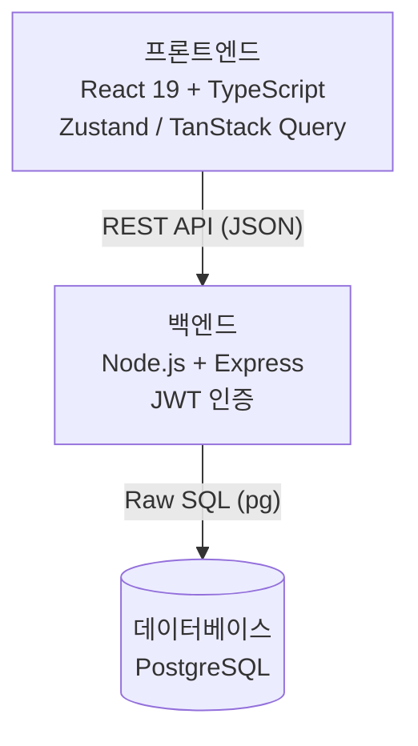
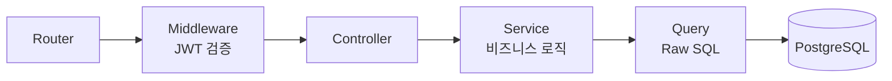
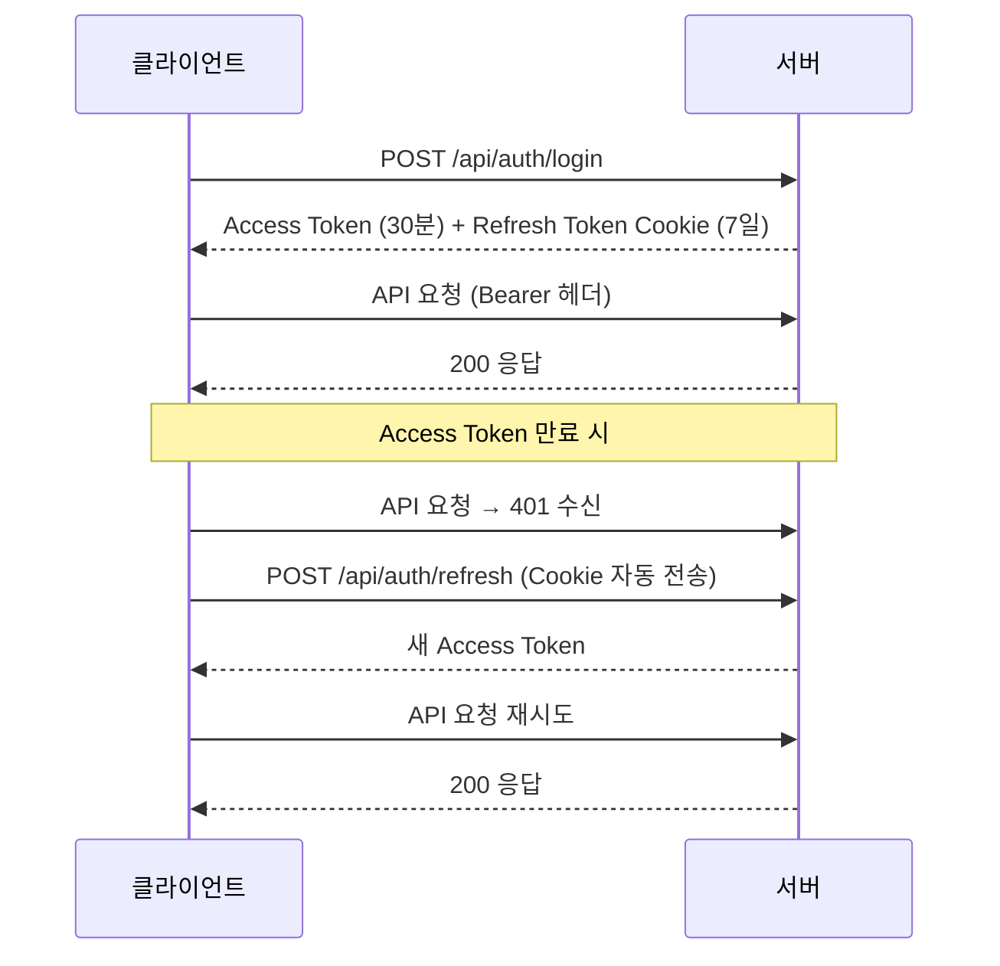
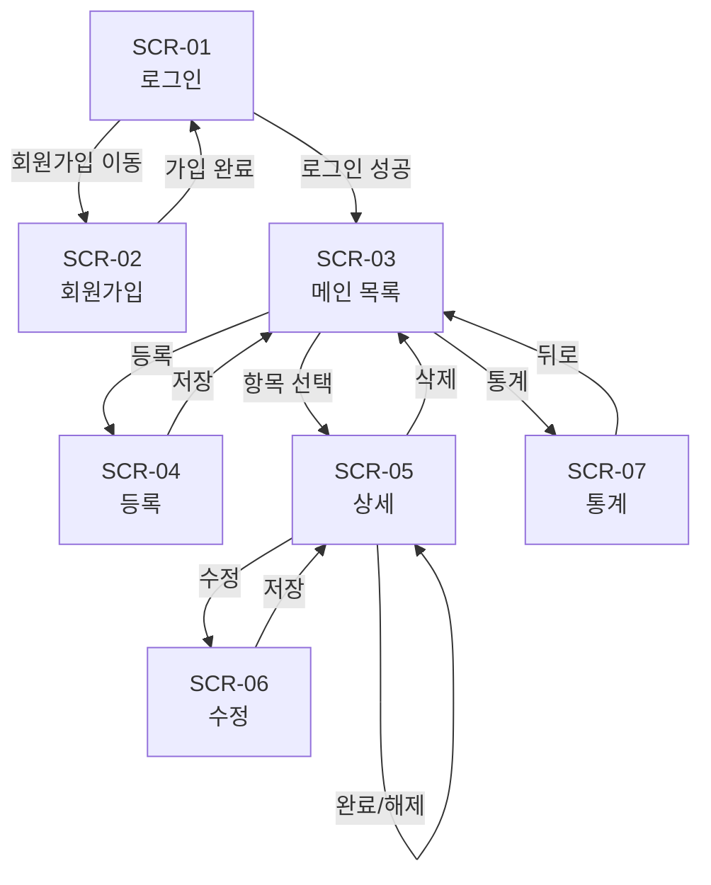
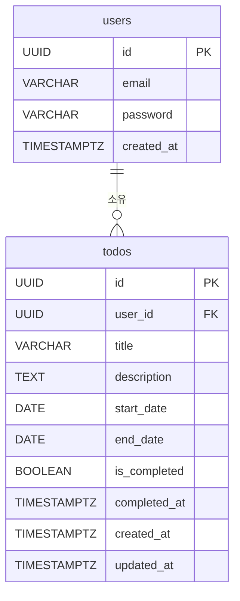

# 기술 아키텍처 다이어그램: todolist-app

> 버전: 1.0.0
> 작성일: 2026-03-31
> 작성자: Senior Backend Developer
> 참조 문서: `docs/1-domain-definition.md`, `docs/2-prd.md`, `docs/4-project-structure.md`

### 변경 이력

| 버전 | 날짜 | 변경 내용 |
|------|------|----------|
| 1.0.0 | 2026-03-31 | 최초 작성 |

---

## 1. 시스템 전체 구조

> 3-Tier 아키텍처 개요 — 프론트엔드, 백엔드, 데이터베이스 각 레이어의 핵심 기술 스택을 표시한다.

---

## 2. 백엔드 레이어 구조

> HTTP 요청이 백엔드 내부를 통과하는 순서 — Router 에서 PostgreSQL 까지의 단방향 흐름을 표시한다.

---

## 3. 인증 흐름

> 로그인부터 Silent Refresh 까지의 전체 인증 시퀀스를 표시한다.

---

## 4. 화면 네비게이션

> 7개 화면 간 이동 흐름 — 인증 여부에 따른 분기를 포함한다.

---

## 5. ERD

> users 와 todos 두 테이블의 관계 및 핵심 컬럼을 표시한다.

