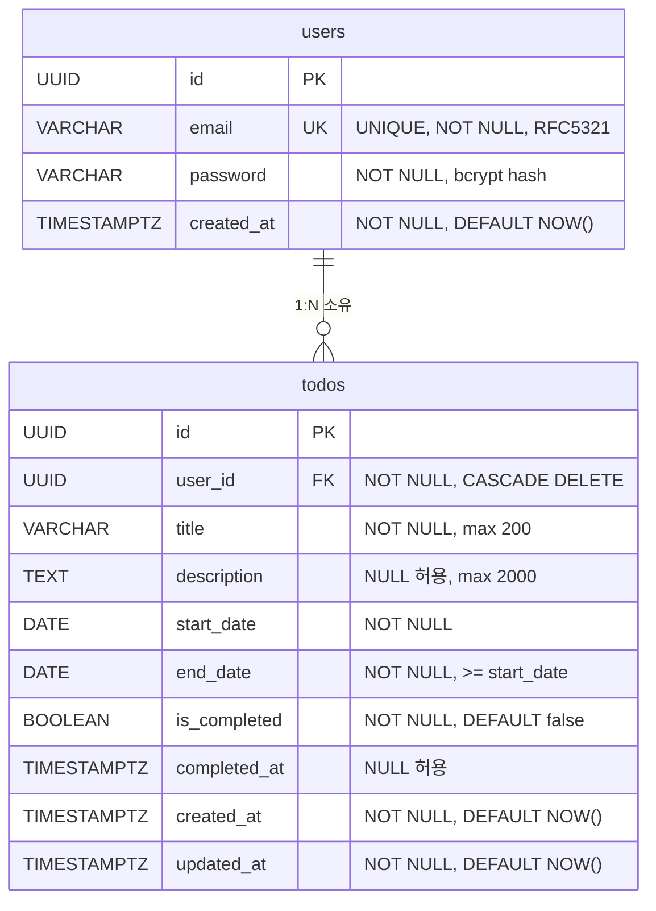

# ERD: todolist-app

> 참조 문서: `docs/1-domain-definition.md` (v1.1.0), `docs/2-prd.md` (v1.2.0)

users 와 todos 두 테이블의 관계 및 핵심 컬럼을 표시한다.
`status` 필드는 DB에 저장하지 않으며 서버에서 실시간 산출한다 (BR-T-05).

```mermaid
erDiagram
    users {
        UUID id PK
        VARCHAR email UK "UNIQUE, NOT NULL, RFC5321"
        VARCHAR password "NOT NULL, bcrypt hash"
        TIMESTAMPTZ created_at "NOT NULL, DEFAULT NOW()"
    }

    todos {
        UUID id PK
        UUID user_id FK "NOT NULL, CASCADE DELETE"
        VARCHAR title "NOT NULL, max 200"
        TEXT description "NULL 허용, max 2000"
        DATE start_date "NOT NULL"
        DATE end_date "NOT NULL, >= start_date"
        BOOLEAN is_completed "NOT NULL, DEFAULT false"
        TIMESTAMPTZ completed_at "NULL 허용"
        TIMESTAMPTZ created_at "NOT NULL, DEFAULT NOW()"
        TIMESTAMPTZ updated_at "NOT NULL, DEFAULT NOW()"
    }

    users ||--o{ todos : "1:N 소유"
```
