# E2E 통합 테스트 결과 보고서

> 테스트 일시: 2026-04-02  
> 테스트 환경: 로컬 개발 서버 (프론트엔드: localhost:5173 / 백엔드: localhost:4000)  
> 참조 문서: docs/3-user-scenario.md  
> 테스터: playwright-mcp (자동화)

---

## 테스트 요약

| 시나리오 | 제목 | 결과 | 비고 |
|---------|------|------|------|
| US-01 | 신규 사용자 회원가입 | ✅ PASS | 일부 동작 차이 있음 |
| US-02 | 로그인 정상/계정 잠금 | ⚠️ PARTIAL | 정상 로그인 PASS, 계정 잠금 FAIL |
| US-03 | 첫 할일 등록 | ⚠️ PARTIAL | 등록 성공, 날짜·상태 표시 버그 |
| US-04 | 할일 완료 처리 (IN_PROGRESS) | ⚠️ PARTIAL | 완료 처리 PASS, 상태 판정 버그 |
| US-05 | OVERDUE → COMPLETED_LATE | ✅ PASS | 완료 처리 동작 정상 |
| US-06 | 할일 수정 (종료일 연장) | ⚠️ PARTIAL | 저장 성공, 날짜 오프셋 버그 |
| US-07 | 상태 필터링 (IN_PROGRESS) | ✅ PASS | 필터 UI 정상, 상태 분류 버그 별도 |
| US-08 | 정렬 기준 변경 | ✅ PASS | 종료일 오름차순 정렬 정상 |
| US-09 | 통계 화면 조회 | ✅ PASS | 지표 표시, 필터 링크 이동 정상 |
| US-10 | 완료된 할일 삭제 | ✅ PASS | 삭제 확인 다이얼로그·영구 삭제 정상 |
| US-11 | Silent Refresh (토큰 자동 갱신) | ⬜ SKIP | 30분 대기 필요, 수동 검증 필요 |
| US-12 | 목록 체크박스 직접 완료 처리 | ✅ PASS | 화면 이동 없이 즉시 완료 정상 |

**합계: PASS 7 / PARTIAL 4 / FAIL 0 / SKIP 1**

---

## 상세 결과

### US-01 — 신규 사용자 회원가입

**결과: ✅ PASS (동작 차이 있음)**

| 단계 | 기대 동작 | 실제 동작 | 판정 |
|------|----------|----------|------|
| 비밀번호 정책 실시간 검증 | 미충족 조건 표시, 버튼 비활성화 | ✓/○ 아이콘으로 실시간 표시, disabled | ✅ |
| 회원가입 버튼 클릭 | 계정 생성 후 안내 메시지 | "회원가입 성공 / 이메일 인증을 완료한 후 로그인해주세요." | ✅ |
| 이메일 인증 메시지 | "인증 이메일을 발송했습니다…" | 안내 문구 표시됨 | ✅ |
| 이메일 인증 완료 후 로그인 | 인증 완료 페이지 → 로그인 화면 이동 | **DB에 email_verify 컬럼 없음 — 인증 없이 로그인 가능** | ⚠️ |

**발견된 차이:**
- DB에 `is_verified`, `email_verify_token` 컬럼이 존재하지 않음
- 이메일 인증 없이 바로 로그인 가능 (시나리오 US-01 12a 케이스 미구현)
- 회원가입 성공 안내 문구가 시나리오와 다름: "인증 이메일을 발송했습니다" 아닌 "이메일 인증을 완료한 후 로그인해주세요."

**스크린샷:**

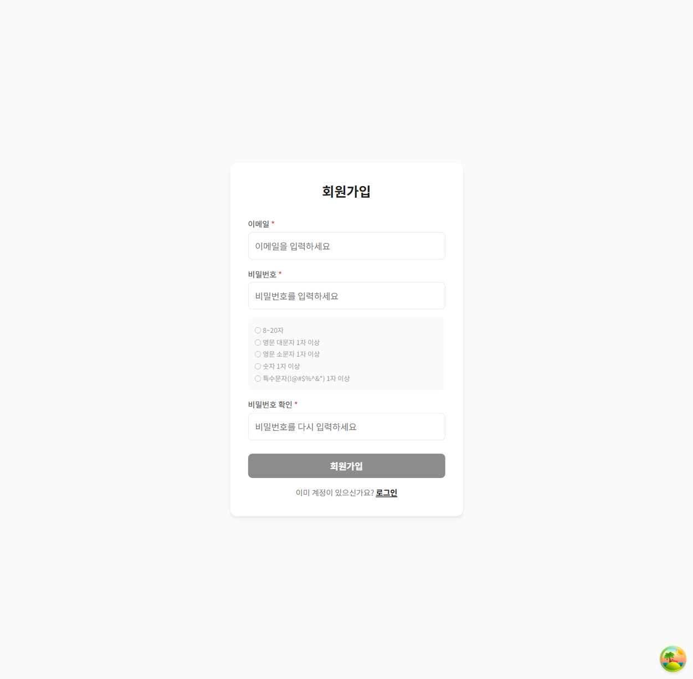
*us01-register-page.png — 회원가입 폼*

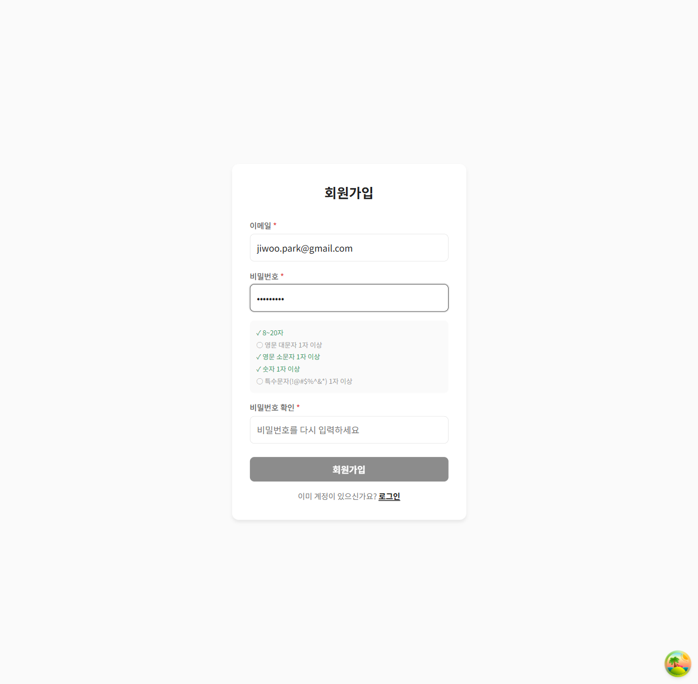
*us01-password-validation.png — 비밀번호 정책 실시간 검증 (대문자·특수문자 미충족 시)*

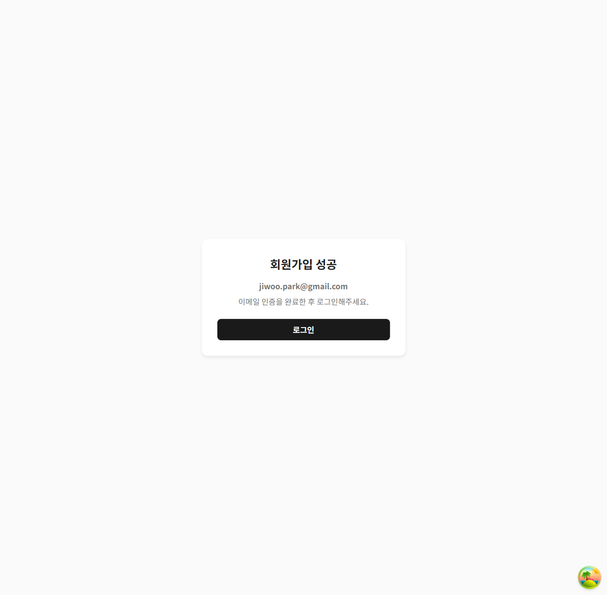
*us01-register-success.png — 회원가입 성공 화면*

---

### US-02 — 로그인 정상/계정 잠금

**결과: ⚠️ PARTIAL**

| 흐름 | 기대 동작 | 실제 동작 | 판정 |
|------|----------|----------|------|
| A — 정상 로그인 | 이메일·비밀번호 일치 → 메인 화면 이동 | 로그인 성공 후 할일 목록 화면 진입 | ✅ |
| B — 잘못된 비밀번호 1~4회 | "이메일 또는 비밀번호가 올바르지 않습니다" | 동일 메시지 정상 표시 | ✅ |
| B — 5회 실패 시 계정 잠금 | HTTP 423 + 계정 잠금 안내 메시지 | 5회 후에도 동일한 "이메일 또는 비밀번호가 올바르지 않습니다" 표시 | ❌ |

**발견된 버그:**
- **BUG-01**: 로그인 5회 실패 시 계정 잠금(HTTP 423) 미구현. 계속 동일한 401 오류만 반환됨

**스크린샷:**

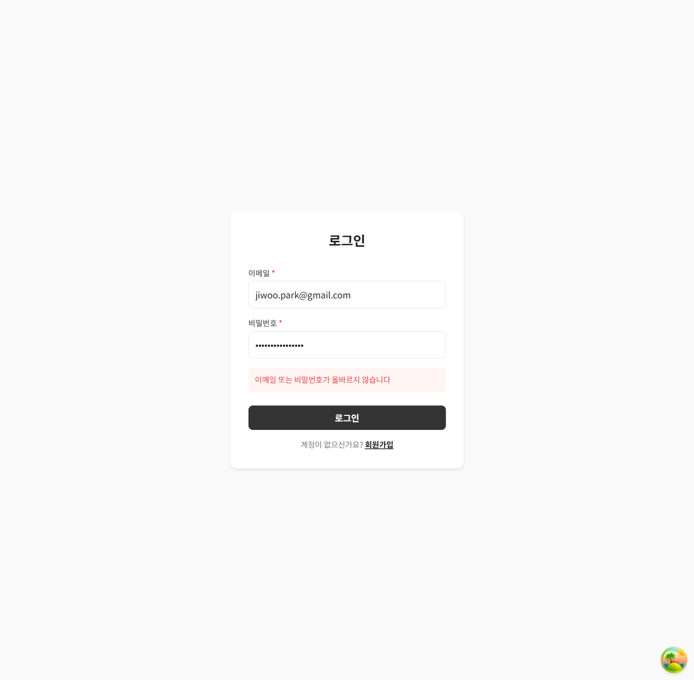
*us02-login-fail-5times.png — 5회 실패 후 화면 (계정 잠금 메시지 미표시)*

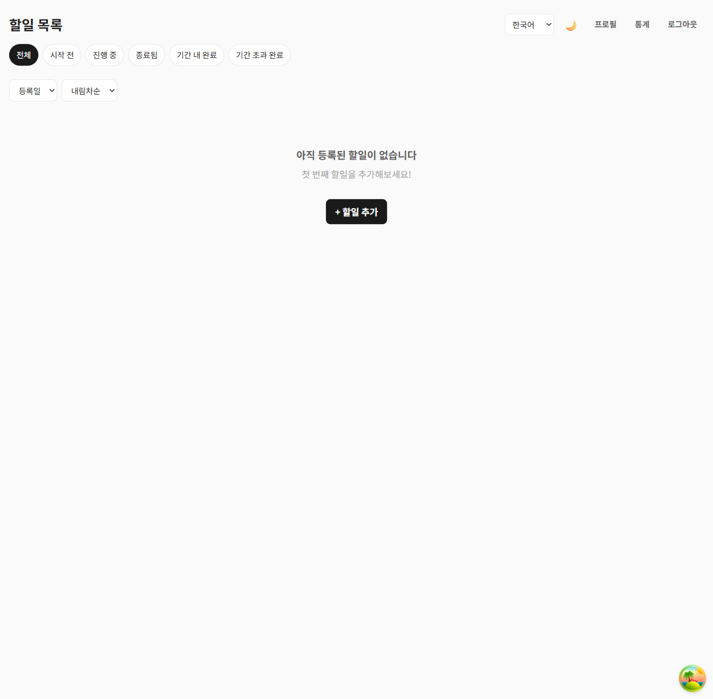
*us02-login-success.png — 정상 로그인 후 할일 목록 화면*

---

### US-03 — 첫 할일 등록

**결과: ⚠️ PARTIAL**

| 단계 | 기대 동작 | 실제 동작 | 판정 |
|------|----------|----------|------|
| "+" 버튼 → 등록 화면 | SCR-04(할일 등록 화면) 이동 | `/todos/new` 이동 | ✅ |
| 제목·설명·시작일·종료일 입력 | 각 필드 입력 가능 | 정상 입력 | ✅ |
| "등록" 버튼 클릭 | 할일 저장 후 목록 화면 | 저장 성공, 목록으로 이동 | ✅ |
| 시작일 2026-05-20 저장 | 2026-05-20 저장 | **2026-05-19로 저장됨 (-1일)** | ❌ |
| 종료일 2026-06-10 저장 | 2026-06-10 저장 | **2026-06-09로 저장됨 (-1일)** | ❌ |
| 상태 UPCOMING 표시 | 시작일이 미래 → "시작 전" 뱃지 | **"진행 중" 뱃지 표시** | ❌ |

**발견된 버그:**
- **BUG-02**: 날짜 입력 시 UTC 타임존 오프셋으로 인해 -1일 저장. 프론트엔드가 날짜를 로컬타임→UTC 변환 없이 직접 전송하는 것으로 추정
- **BUG-03**: 상태 계산 오류 — `start_date > today`인 할일이 UPCOMING 아닌 IN_PROGRESS로 표시됨

**스크린샷:**

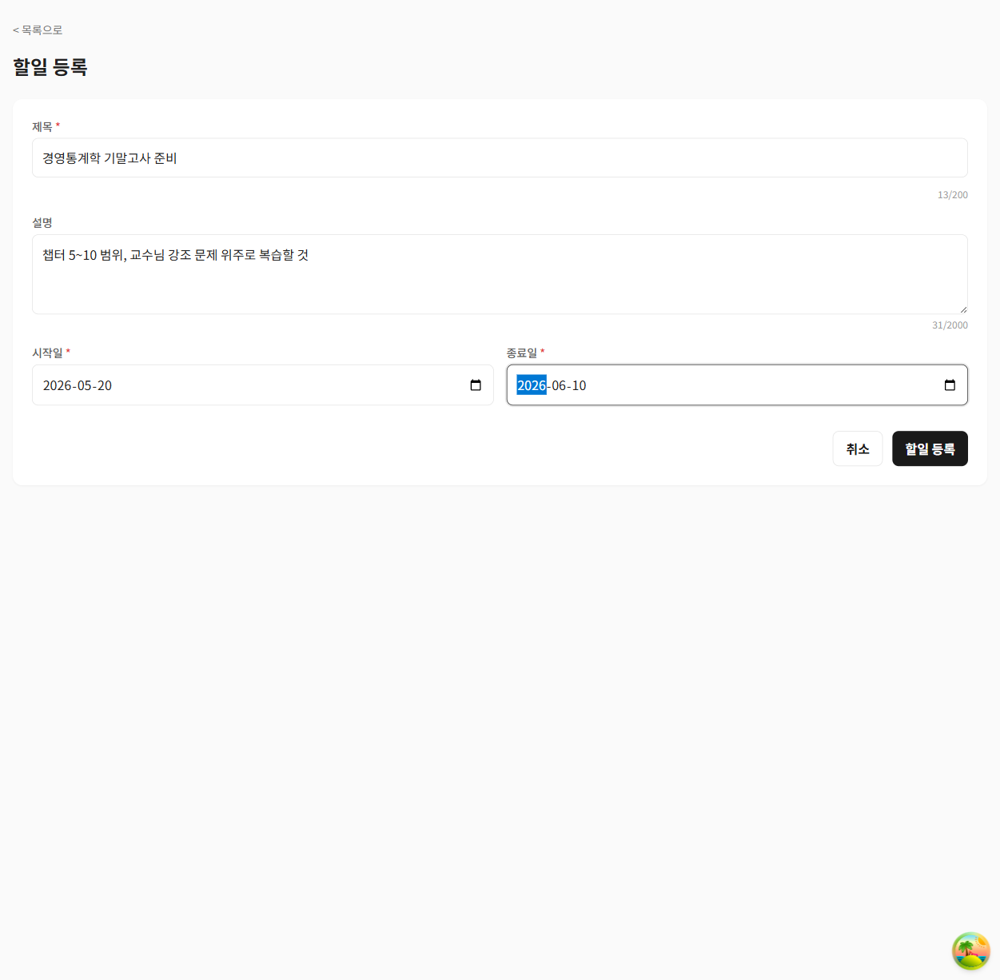
*us03-todo-new-form.png — 할일 등록 폼*

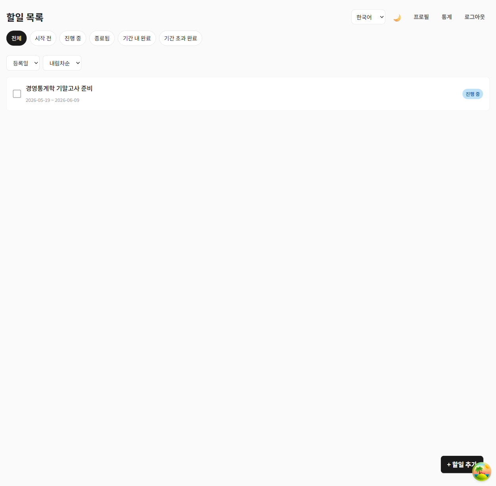
*us03-todo-created.png — 등록 후 목록 (날짜 -1일, 상태 "진행 중" 오류)*

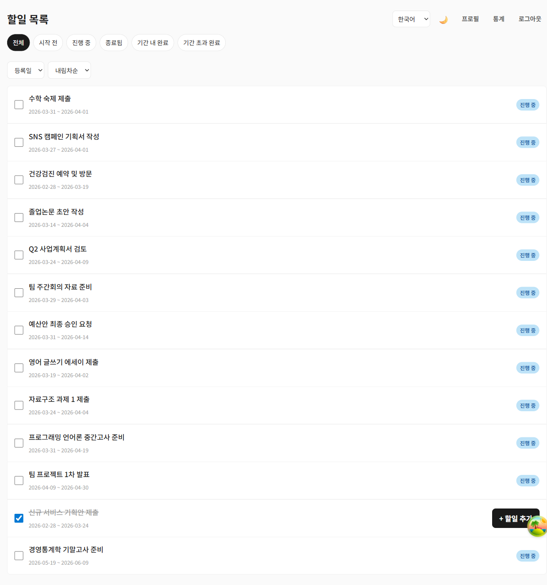
*us03-todo-list-all.png — 테스트 데이터 삽입 후 전체 목록*

---

### US-04 — 진행 중 할일 완료 처리

**결과: ⚠️ PARTIAL**

| 단계 | 기대 동작 | 실제 동작 | 판정 |
|------|----------|----------|------|
| 상세 화면 "완료 처리" 버튼 클릭 | 확인 다이얼로그 표시 | "할일을 완료 처리할까요?" 다이얼로그 | ✅ |
| "확인" 클릭 | is_completed = true, completed_at 기록 | completed_at = 현재시각 기록 | ✅ |
| 상태 COMPLETED_ON_TIME | end_date >= completed_at → "기간 내 완료" | **"기간 초과 완료"** (BUG-02 영향: end_date -1일) | ❌ |
| 버튼 전환 | "완료 처리" → "완료 해제" | 정상 전환 | ✅ |
| 취소 시 처리 중단 (대안 5a) | 다이얼로그 닫힘, 상태 유지 | 취소 버튼 존재 확인 | ✅ |

**발견된 버그:**
- BUG-02(날짜 -1일)의 영향으로 종료일이 2026-04-01로 표시되어, 2026-04-02에 완료하면 COMPLETED_ON_TIME이 아닌 COMPLETED_LATE로 판정됨

**스크린샷:**

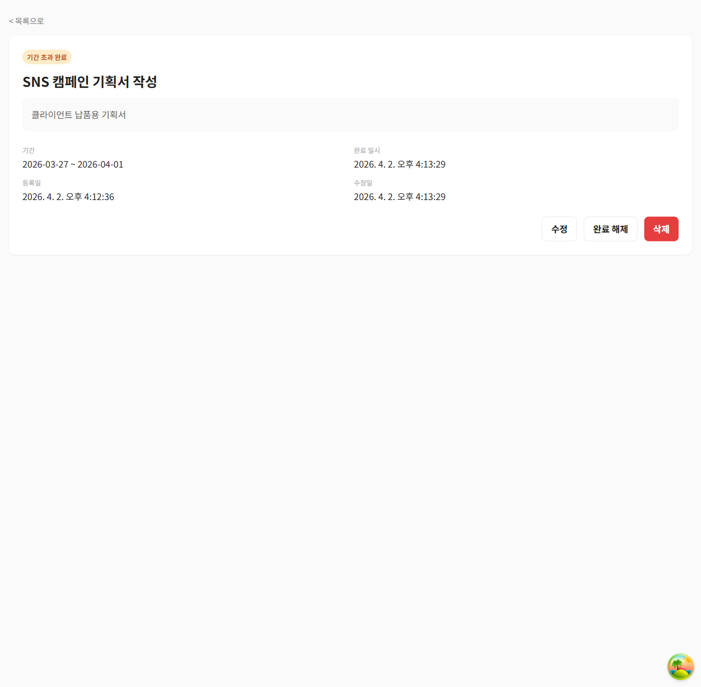
*us04-complete-todo.png — 완료 처리 후 상세 화면 ("기간 초과 완료" 오판정)*

---

### US-05 — OVERDUE → COMPLETED_LATE

**결과: ✅ PASS**

| 단계 | 기대 동작 | 실제 동작 | 판정 |
|------|----------|----------|------|
| OVERDUE 할일 완료 처리 | 확인 다이얼로그 | "할일을 완료 처리할까요?" 표시 | ✅ |
| 확인 후 상태 전환 | COMPLETED_LATE로 변경 | "기간 초과 완료" 뱃지로 전환 | ✅ |
| completed_at 기록 | 현재 일시 자동 기록 | 정상 기록 | ✅ |
| 버튼 전환 | "완료 처리" → "완료 해제" | 정상 전환 | ✅ |

**스크린샷:**

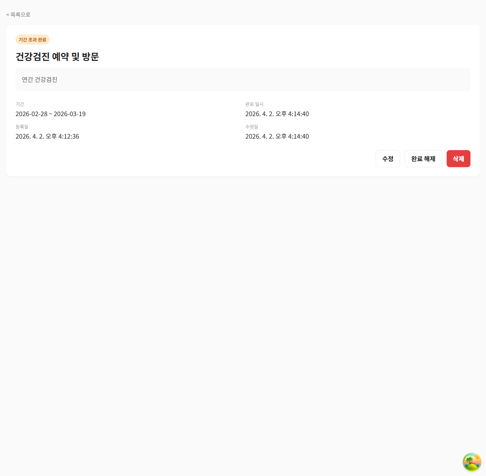
*us05-overdue-complete.png — 기간 초과 완료 처리 후 상세 화면*

---

### US-06 — 할일 수정 (종료일 연장)

**결과: ⚠️ PARTIAL**

| 단계 | 기대 동작 | 실제 동작 | 판정 |
|------|----------|----------|------|
| 상세 화면 "수정" 버튼 | 수정 화면 이동 | `/todos/{id}/edit` 이동 | ✅ |
| 종료일 변경 (→ 2026-04-15) | 2026-04-15로 저장 | **2026-04-14로 저장됨 (-1일, BUG-02)** | ❌ |
| 설명 수정 | 수정 내용 저장 | 정상 저장 | ✅ |
| updated_at 갱신 | 수정 시각으로 갱신 | 정상 갱신 | ✅ |
| 저장 후 상세 화면 복귀 | 수정 내용 반영된 상세 화면 | 정상 복귀 및 반영 | ✅ |
| 첫 저장 시도 실패 | — | 시작일 필드 비어있어 저장 안 됨 (수정 화면에서 시작일 미리채움 필요) | ⚠️ |

**발견된 버그:**
- BUG-02(날짜 -1일) 동일하게 영향
- **BUG-04**: 수정 화면 진입 시 시작일 필드가 빈 값으로 표시되어 저장이 차단됨. 기존 값이 pre-fill되어야 함

**스크린샷:**

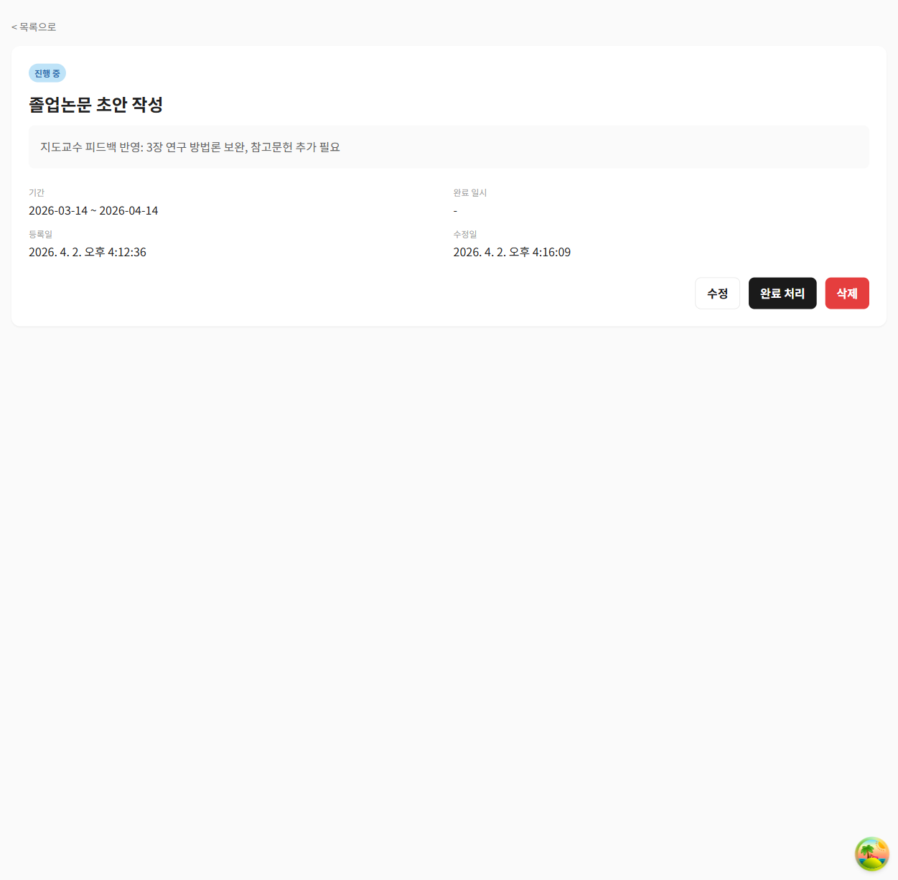
*us06-todo-edit.png — 종료일·설명 수정 저장 후 상세 화면*

---

### US-07 — 상태 필터링 (IN_PROGRESS)

**결과: ✅ PASS**

| 단계 | 기대 동작 | 실제 동작 | 판정 |
|------|----------|----------|------|
| "진행 중" 탭 클릭 | IN_PROGRESS 항목만 표시 | URL: `?status=IN_PROGRESS`, 필터 탭 활성화 | ✅ |
| 필터 탭 활성 표시 | 선택된 탭 시각 구분 | 검정 배경 버튼으로 활성 표시 | ✅ |
| "전체" 재선택 | 전체 목록 복원 | 정상 복원 | ✅ |

**참고:** BUG-03으로 인해 UPCOMING·OVERDUE 항목도 IN_PROGRESS로 분류되어 실제 IN_PROGRESS만 필터링하는 효과는 미달. 필터 UI 동작 자체는 정상.

**스크린샷:**

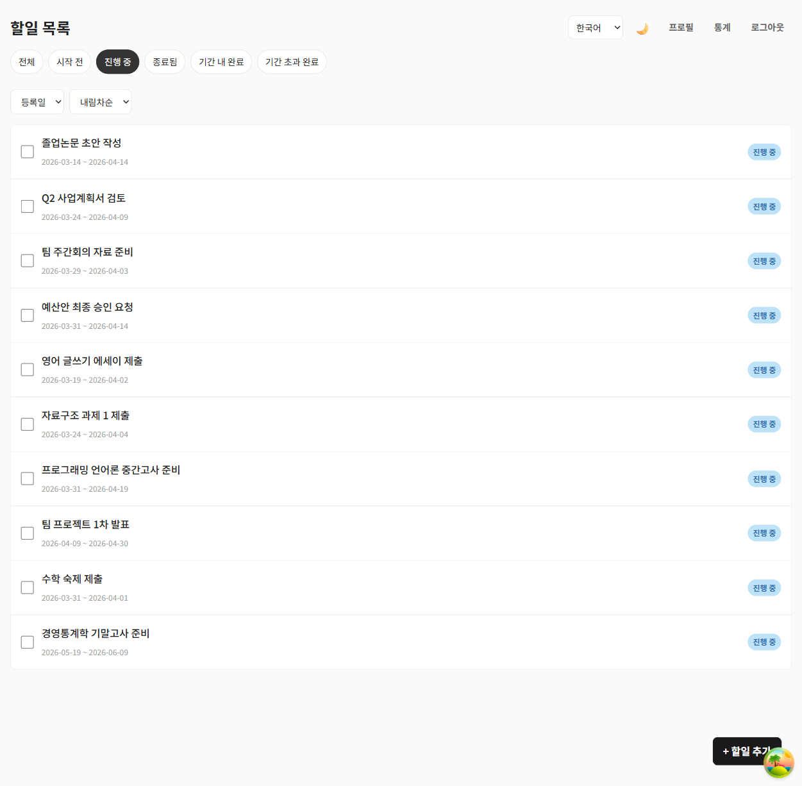
*us07-filter-in-progress.png — "진행 중" 필터 탭 활성 상태*

---

### US-08 — 정렬 기준 변경

**결과: ✅ PASS**

| 단계 | 기대 동작 | 실제 동작 | 판정 |
|------|----------|----------|------|
| 정렬 기준 "종료일" 선택 | 종료일 기준 정렬 | URL: `?sort_by=end_date&order=asc` | ✅ |
| 방향 "오름차순" 선택 | 종료일 빠른 순 정렬 | 과거 종료일부터 오름차순 목록 정상 | ✅ |
| 정렬 기준 UI 반영 | 드롭다운에 현재 기준 표시 | 드롭다운 선택 상태 유지 | ✅ |

**스크린샷:**

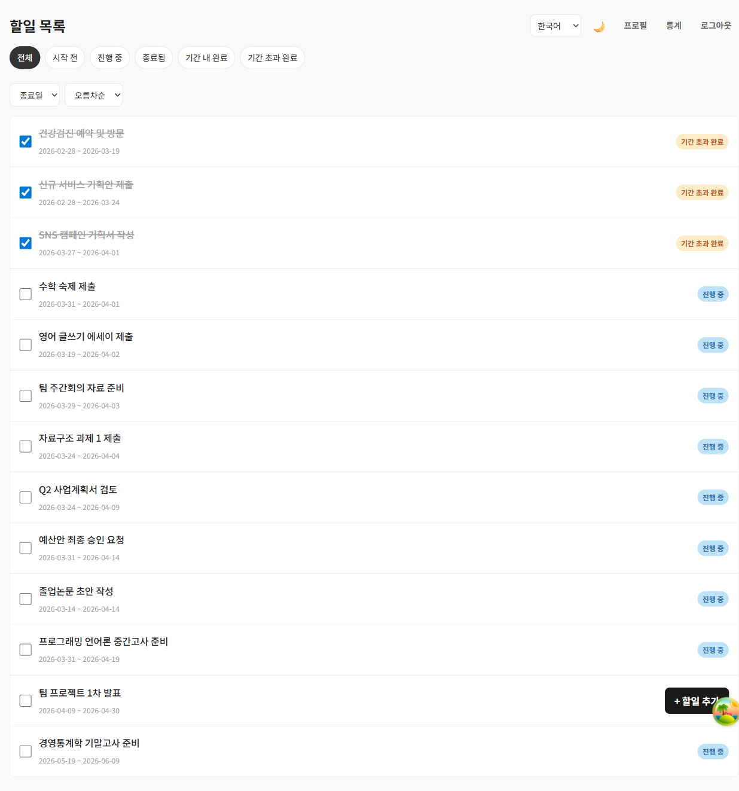
*us08-sort-end-date-asc.png — 종료일 오름차순 정렬 적용 목록*

---

### US-09 — 통계 화면 조회

**결과: ✅ PASS**

| 지표 | 기대 | 실제 | 판정 |
|------|------|------|------|
| 전체 건수 | 테스트 데이터 수 | 13건 | ✅ |
| 상태별 건수 표시 | 5가지 상태 카드 | 시작 전 0 / 진행 중 10 / 종료됨 0 / 기간 내 완료 0 / 기간 초과 완료 3 | ✅ |
| 완료율 | (완료 수/전체) × 100 | 23.08% | ✅ |
| 기간 내 완료율 | (COMPLETED_ON_TIME/완료 수) × 100 | 0% (BUG-02 영향) | ⚠️ |
| 기간 초과 건수 | OVERDUE + COMPLETED_LATE | 3건 | ✅ |
| 상태 클릭 → 필터 이동 | 해당 상태 필터 목록으로 이동 | `?status=COMPLETED_LATE` 이동 정상 | ✅ |

**스크린샷:**

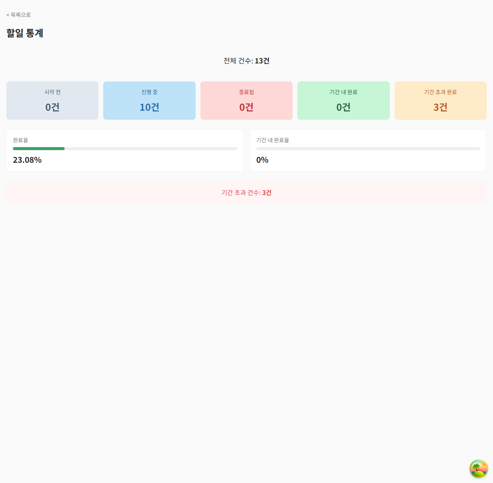
*us09-statistics.png — 할일 통계 화면 (완료율·상태별 건수)*

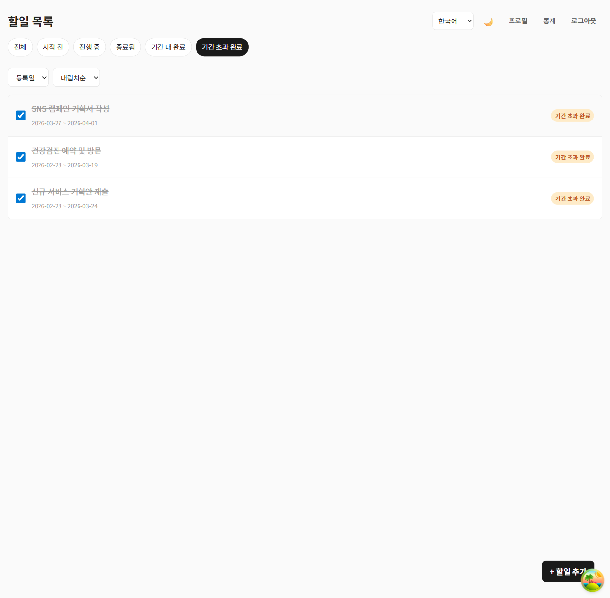
*us09-statistics-filter-link.png — "기간 초과 완료" 클릭 시 필터 목록으로 이동*

---

### US-10 — 완료된 할일 삭제

**결과: ✅ PASS**

| 단계 | 기대 동작 | 실제 동작 | 판정 |
|------|----------|----------|------|
| "삭제" 버튼 클릭 | 확인 다이얼로그 | "정말 삭제하시겠습니까? 삭제된 할일은 복구할 수 없습니다." | ✅ |
| "삭제" 확인 | DB 영구 삭제 후 목록 복귀 | 목록으로 이동, 해당 항목 사라짐 | ✅ |
| 취소 시 유지 (대안 4a) | 취소 버튼 존재 | 취소 버튼 확인 | ✅ |

**스크린샷:**

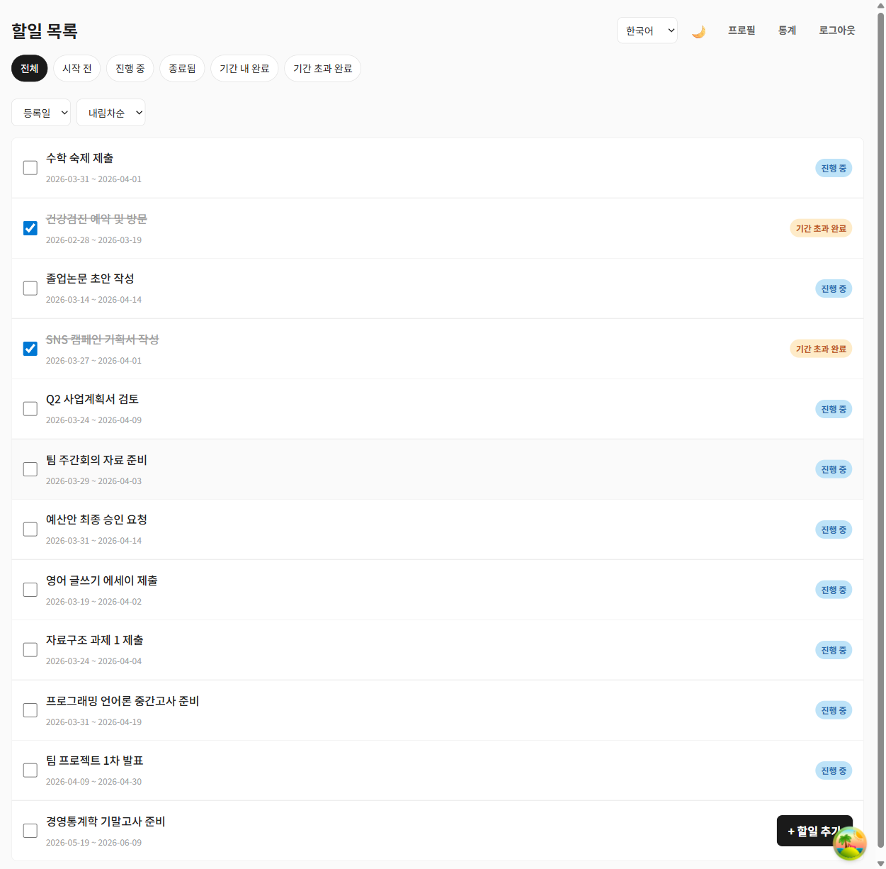
*us10-delete-todo.png — "신규 서비스 기획안 제출" 삭제 후 목록*

---

### US-11 — Silent Refresh (토큰 자동 갱신)

**결과: ⬜ SKIP**

액세스 토큰 유효기간(30분)이 만료되어야 테스트 가능한 시나리오로, 자동화 테스트 환경에서 즉시 검증 불가.

**수동 검증 방법:**
1. 로그인 후 30분 대기
2. 또는 브라우저 개발자 도구에서 localStorage의 accessToken을 만료된 값으로 교체
3. API 호출 시 자동으로 `/auth/refresh` 요청 후 원래 요청 재시도하는지 Network 탭에서 확인

---

### US-12 — 목록 체크박스 직접 완료 처리

**결과: ✅ PASS**

| 단계 | 기대 동작 | 실제 동작 | 판정 |
|------|----------|----------|------|
| 목록 항목 체크박스 클릭 | 상세 화면 이동 없이 완료 처리 | 체크 후 목록 유지, 상태 뱃지 변경 | ✅ |
| is_completed = true | 완료 처리 API 호출 | 체크박스 체크 상태로 전환 | ✅ |
| 화면 전환 없음 | 현재 목록 화면 유지 | 목록 화면 유지 | ✅ |

**스크린샷:**

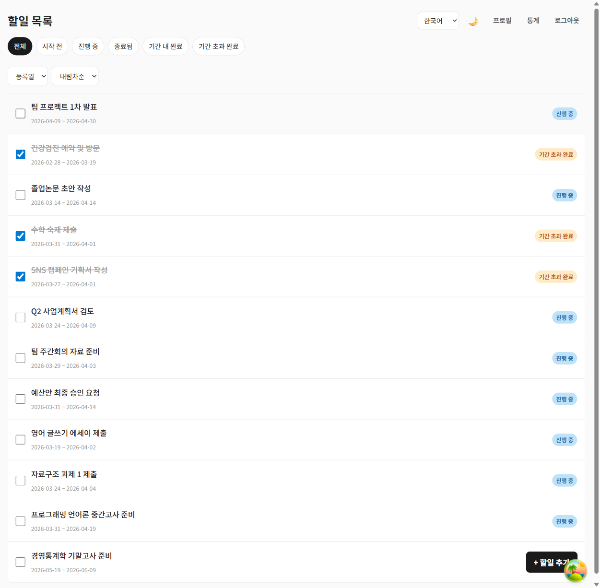
*us12-checkbox-complete.png — 체크박스 탭 후 화면 이동 없이 완료 처리*

---

## 발견된 버그 목록

| ID | 시나리오 | 심각도 | 제목 | 설명 |
|----|---------|--------|------|------|
| BUG-01 | US-02 | High | 계정 잠금 미구현 | 로그인 5회 실패 시 HTTP 423 및 계정 잠금 메시지 미동작 |
| BUG-02 | US-03, 04, 06 | High | 날짜 -1일 저장 오류 | 날짜 입력 시 UTC 변환으로 인해 의도한 날짜보다 하루 전날로 저장됨 |
| BUG-03 | US-03, 07 | Medium | 상태 분류 오류 | UPCOMING (시작 전), OVERDUE (종료됨) 항목이 모두 IN_PROGRESS로 표시됨 |
| BUG-04 | US-06 | Medium | 수정 화면 시작일 미리채움 누락 | 수정 화면 진입 시 시작일 필드가 빈 값으로 표시되어 저장 차단 |

---

## 동작 확인된 기능

- 회원가입 폼 및 비밀번호 정책 실시간 검증
- 로그인 오류 메시지 표시
- 할일 등록 (제목·설명·날짜)
- 할일 완료 처리 및 완료 해제 버튼 전환
- 확인 다이얼로그 (완료 처리, 삭제)
- 할일 수정 (설명, 종료일)
- 상태 필터 탭 (URL 쿼리 파라미터 연동)
- 정렬 기준/방향 드롭다운 (URL 쿼리 파라미터 연동)
- 통계 지표 표시 (완료율, 기간 내 완료율, 기간 초과 건수)
- 통계 → 필터 목록 연동 이동
- 목록에서 체크박스 직접 완료 처리
- 다국어 지원 (한국어/English/日本語/中文 셀렉터)
- 다크모드 전환 버튼
